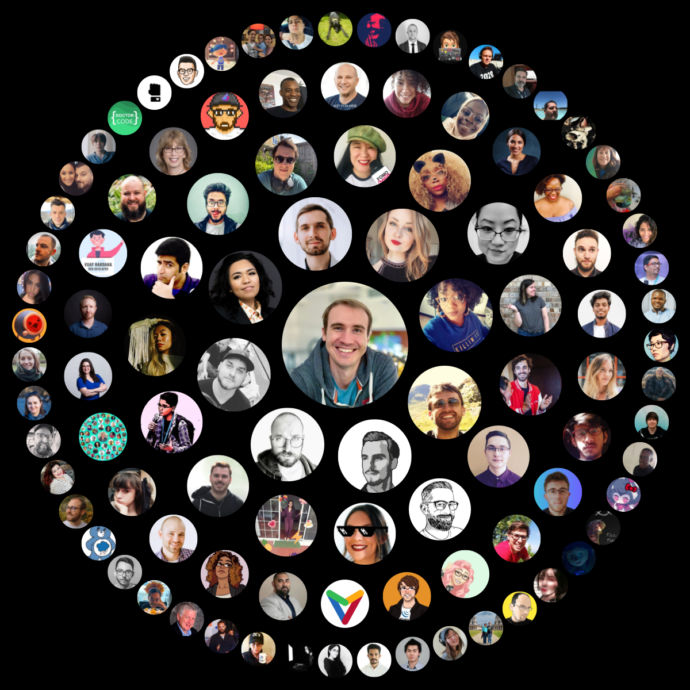

# Twitter Interaction Circle

Originally from [Twopcharts](https://twopcharts.com/) it has been making the round in the dev community.
I believe this is a great opportunity for a project to learn from. 
The concept is easy and straightforward but the realization encompasses a lot of concepts.

You can read more about the realization of this project on the [HackerTyper Blog](https://blog.hackertyper.net/post/twitter-interaction-circles-guide/)

This a fork of the original by @Duiker101. This one lists the maximum 100 users allowed and an additional circle layer.
Avatar radius, distance from center have been adjusted for optimal spacing.

## Pre-requisites

Updated NodeJS. OS default version may be too obsolete to run this code.

## Installation
```shell script
git clone <repo>
cd twitter-interaction-circle
yarn install
```

Run with 
```shell script
yarn build
```

You can also generate a text version of the image with the complete list of the presented users with the following command
```shell script
yarn build --text
```
The output will go in `users.txt` file in the root of the project

## Setup
To use the project you will need Twitter API keys. You can get one on the [developer portal](https://developer.twitter.com).

As this project uses only public data, you don't need an authorization key, but you can generate a Bearer Token. This will prevent you from fetching any private data but will grant you slightly higher rate limiting.

More information about Twitter's bearer tokens can be found [here](https://developer.twitter.com/en/docs/basics/authentication/oauth-2-0)

Once you have your consumer keys, rename the `.env.example` file `.env` and put them in there, it should look like this:

```dotenv
USERNAME="<username>"
CANVAS_BG="#XXXXXX"
CONSUMER_KEY=AAAA
CONSUMER_SECRET=BBBBBB
```

Type the target username and desired background color. Make sure you don't have spaces in the keys. 

## Modifications

If you wish, you can replace the first part of the main loop in the `index.js` to use the getUser() function instead of getMe().
This will allow you to generate the circles for any public Twitter user. All the API methods used take advantage only of public data.

## Challenges

You can try to apply the following changes to test your knowledge:
- Apply a shade to  each avatar based on the most common type of interaction
- Fetch the circles for another user
- Render a grid instead of the circles
